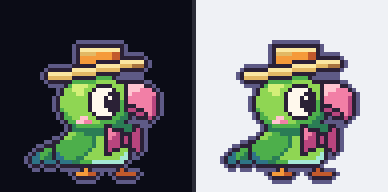
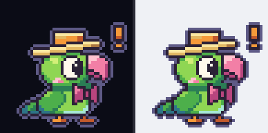
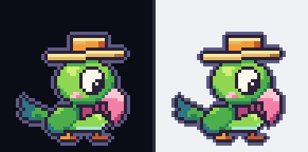
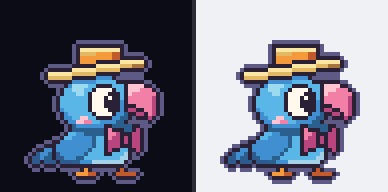
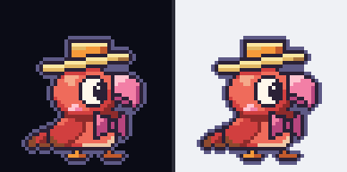

<div align="center">

# Zeca 🦜

**A pixel-art desktop pet that lives on your screen and reacts to [Claude Code](https://claude.com/claude-code).**



Zeca celebrates when Claude finishes, calls you when it needs you, and naps when you step away.
He sits on top of everything, follows your active monitor, and can be dragged anywhere.
**Bring your own sprite** and he becomes *your* pet.

*[Leia em português →](README.pt-BR.md)*

</div>

---

## Install

One command.

**macOS** (Apple Silicon or Intel):

```sh
curl -fsSL https://raw.githubusercontent.com/butkeraites/claude-pet/main/scripts/get.sh | sh
```

**Windows** (PowerShell):

```powershell
irm https://raw.githubusercontent.com/butkeraites/claude-pet/main/scripts/get.ps1 | iex
```

That's it — it downloads a build, drops the pet on your screen, wires it into Claude Code, and starts at login. No repo, no toolchain, no config. (Windows builds are being set up for code signing through [SignPath Foundation](https://signpath.org/) — free code signing for open source. Until it's live, SmartScreen may warn once, so choose *More info → Run anyway*.)

> Linux is on the way. On Linux you can run it from source today (see [Development](#development)).

Open a new terminal, run `claude`, and Zeca starts reacting. To remove: `claude plugin uninstall bichinho` and `~/Library/Application Support/bichinho`'s LaunchAgent (`scripts/mac-desinstalar.sh --tudo`).

## What he does

| | |
|---|---|
|  | **Claude finished** → a hop, a short flight, confetti — and a bigger flight across the screen with a confetti rain when the job was large. |
|  | **Claude needs you** (a question, a plan to approve, a permission) → he chirps with a `!` and a bubble showing the project. If you're not looking, the call escalates — always with a ceiling. |
|  | **Working** → nearly still, pecking a seed now and then. |
|  | **Nobody around** → yawns and sleeps. |

**Click him** to jump straight to the terminal of the session that needs you most. **Drag him** anywhere; he remembers where you put him on each monitor, and follows the monitor you're working on.

He sees **every** Claude Code session — even the ones you opened *before* installing him — by reading your session transcripts, so there's nothing to reload or reconnect.

## Privacy first

Zeca only ever handles **metadata** — event names, a session id, the project folder name, a hash of an edited file's path. **Your prompts, Claude's responses, your code, and window titles never leave your machine, never go to a log, and are never written to disk.** The daemon binds to `127.0.0.1` only, speaks to no network, and leaves no core dump. See [the golden rules](CONTRIBUTING.md#the-golden-rules).

## Make it yours 🎨

Zeca is just the default — his art is **CC0** (public domain), so you can do anything with it. The whole point is *your* pet.

<div align="center">



<br><em>Same bird, three palettes — all three ship in <code>skins/</code>.</em>
</div>

A skin is just a **sprite sheet + a small `skin.json`** that maps animations to states (`idle`, `done_small`, `calling`, …). The blue and fire Zecas above are palette swaps of the original sheet, made by a tiny, reproducible script ([`arte/zeca-livre/recolorir.py`](arte/zeca-livre/recolorir.py)) — so even a recolor is a one-liner. Bring a whole new sprite sheet and you've got your own creature.

See [docs/SKINS.md](docs/SKINS.md) for the format. Making custom sprites dead-simple — and a gallery to share them — is an active goal; contributions very welcome.

## How it works

A tiny **native daemon** (Rust) draws the pet as a click-through overlay and learns what Claude Code is doing from two sources:

- **A plugin** (`bichinho`) whose async hooks report events the moment they happen — richer and lower-latency, and it's how clicking the pet can focus the exact terminal window.
- **A transcript observer** that watches `~/.claude/projects/*.jsonl` so the pet sees sessions the plugin hasn't been loaded into yet.

The brain, animator, and all pet logic live in a **platform-pure core** (`pet-core`) with fake-clock tests; the OS-specific window/overlay layers (`pet-macos`, `pet-wayland`, `pet-windows`) implement a small set of traits behind it. Everything is designed to be cheap: an idle, awake pet averages ≤ 2 screen commits per second and 0 while asleep.

## Development

```sh
git clone https://github.com/butkeraites/claude-pet
cd claude-pet
bin/pet verificar       # the gate: fmt, clippy, tests, cross-compile checks
scripts/instalar.sh     # build from source and install locally (macOS)
```

Architecture, the golden rules, and how to add a platform or an animation are in [CONTRIBUTING.md](CONTRIBUTING.md). The full plan and the reasoning behind every decision live in `PLANO.md` and `DECISIONS.md` (in Portuguese, the project's working language).

## Contributing

Issues, ideas, sprites, and platforms all welcome — see [CONTRIBUTING.md](CONTRIBUTING.md). Be kind, keep it playful, and keep Zeca's privacy promises intact.

## License

- **Code:** [MIT](LICENSE).
- **Zeca's art** (`arte/zeca-livre/`, `skins/zeca-livre*`, the GIFs in `docs/img/`): **[CC0 1.0](arte/zeca-livre/LICENSE)** — public domain.

Zeca is an original pixel-art parrot. He isn't, and shouldn't be described as, any third-party character.
